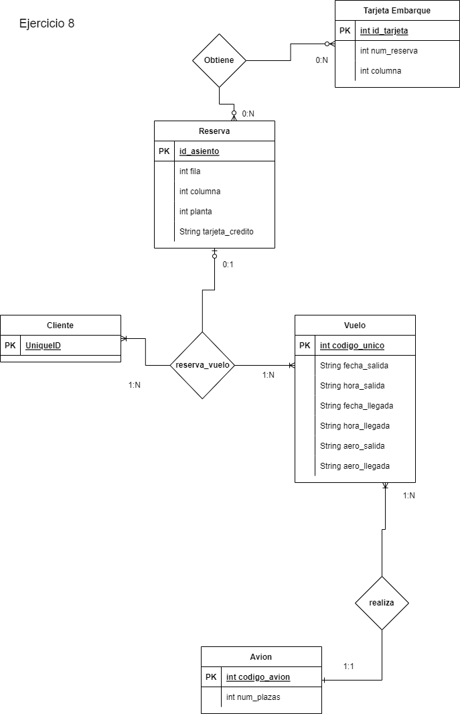

# TA12

<h1>Ejercicio1</h1>

<h1>Ejercicio2</h1>

<h1>Ejercicio3</h1>

<h1>Ejercicio4</h1>

<h1>Ejercicio5</h1>

<h1>Ejercicio6</h1>

<h1>Ejercicio7</h1>

<h1>Ejercicio8</h1>

<h1>Ejercicio9</h1>

<h1>Ejercicio10</h1>

<h1>Ejercicio11</h1>

<h1>Ejercicio12</h1>

<h1>Ejercicio13</h1>

<h1>Ejercicio14</h1>

<h1>Ejercicio15</h1>

<h1>Ejercicio16</h1>

<h1>Ejercicio17</h1>

<h1>Ejercicio18</h1>

